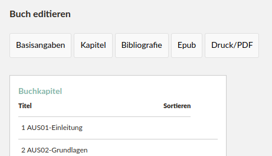
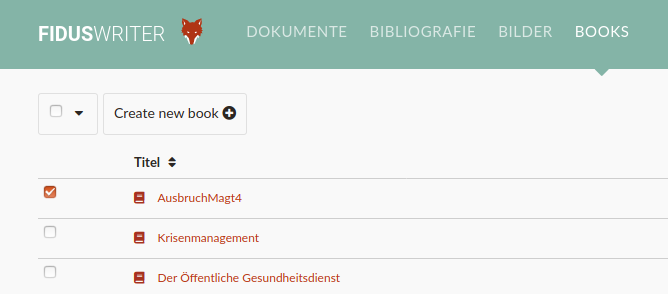
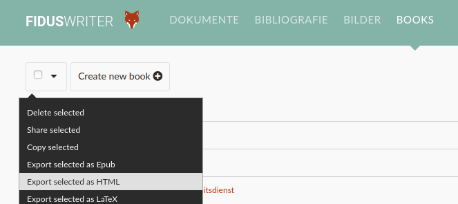

# About this R Package
This R Package has just one special job to be done. If you are not involved with the booksprint project the package will not make sense to you.

The package converts the downloaded fidus-html-files from the book section and converts them into appropriate markdown files.

# Installing
## Setting up your system
First you need to install devtools
```r
install.packages("devtools")
```
then you need to load devtools
```r
library(devtools)
```
now you can install the package fidus2github from github
```r
install_github("akademie-oeffentliches-gesundheitswesen/fidus2github")
```

# Usage
1. Go to Fidus writer on Handbuch.io and log in [Handbuch.io](https://handbuch.io/)
2. Go to the book section [Book section ](https://handbuch.io/book/)
3. Check that the book is properly set up with the right chapters
4. Check the name of each chapter. It should begin with 3 letters (indication the specific book) and then a number

5. Tick the appropriate book

6. Click on export to html

7. Save the file in an empty directory. Easiest way is to save it as "handbuch.zip"
8. Open that directory in R
9. Load the package with 
```r
library(fidus2github)
```
10. Start the function 
```r
convert_fidus_to_github(fiduszipfile = "handbuch.zip")`
```

Now you should have markdown and pictures in you folder, that can be uploaded to github

# Feedback
Probably easiest to write me an E-Mail.
